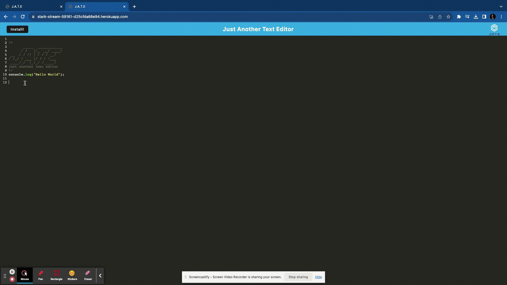
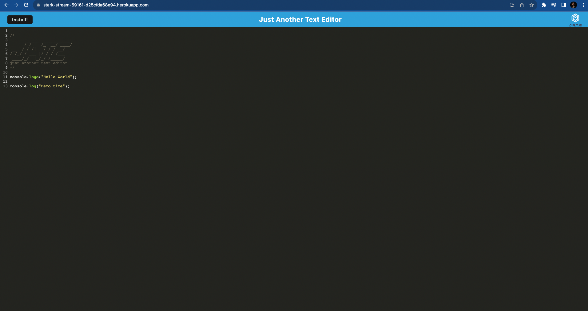
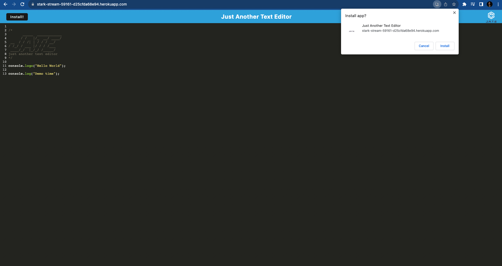
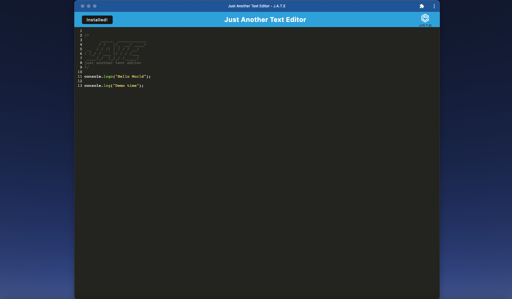
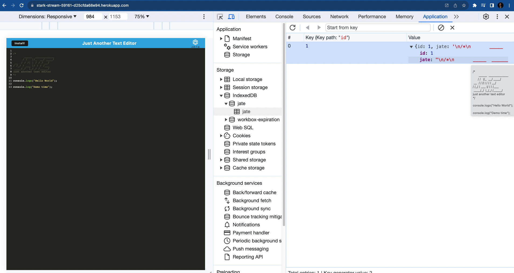
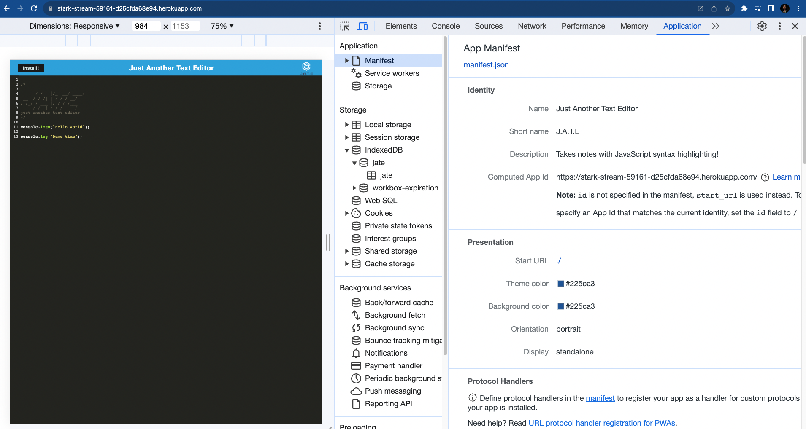
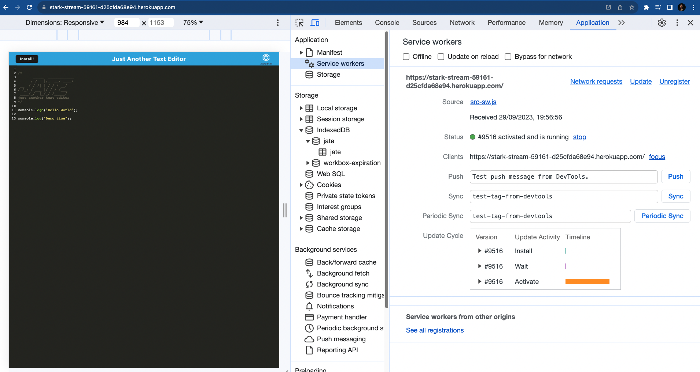

# Just Another Text Editor(JATE)

[](https://opensource.org/licenses/MIT)

## Description

The application helps to build a text editor that runs in the browser. The app will be a single-page application that meets the PWA criteria. It features a number of data persistence techniques that serve as redundancy in case one of the options is not supported by the browser. The application will also function offline. The users can create notes and code snippets with or without an internet connection so that they can retrieve the data for later use. The javascript files have been bundled using webpack. A database storage has been created by IndexDB in the browser to store the text from editor. A service worker is registered using workbox to pre cache the static assets along with subsequent pages. The app can be installed on the desktop with the help of service worker and manifest file.The application uses babel to compile ES6 code to older versions.

## Installation

- Install Node.js v16
- Clone the Repository from GitHub and navigate to the root directory
- Install necessary dependencies running the following command :

  ```
  npm run install
  ```

## Usage

The application can be invoked in the terminal by using the following command:

```
npm run start
```

When the application is invoked using 'npm start', the build will be initiated and the backend starts up to serve the client on port 3001 and the page can be accessed at http://localhost:3001/ .

Deployed application can be found here :

https://stark-stream-59161-d25cfda68e94.herokuapp.com/

The user will be presented with a text editor in the browser when the application is open. The user can enter text or code snippets and the entered text will be saved and it will be available later when the user returns to the page or even after page reload. The app can be installed by clicking the install button on top left of the page or the small install icon present in the address bar. When the install button is clicked it will prompt a confirmation to install. Once installed the button text will be changed to installed and the app can be run on the machine and an icon will appear on the desktop.The user can edit the text offline and it will be saved.

The following images show the application's appearance and functionality :















## Credits

#### References

https://developer.mozilla.org/en-US/docs/Web/API/BeforeInstallPromptEvent

## License

[MIT](https://opensource.org/licenses/MIT) license.
